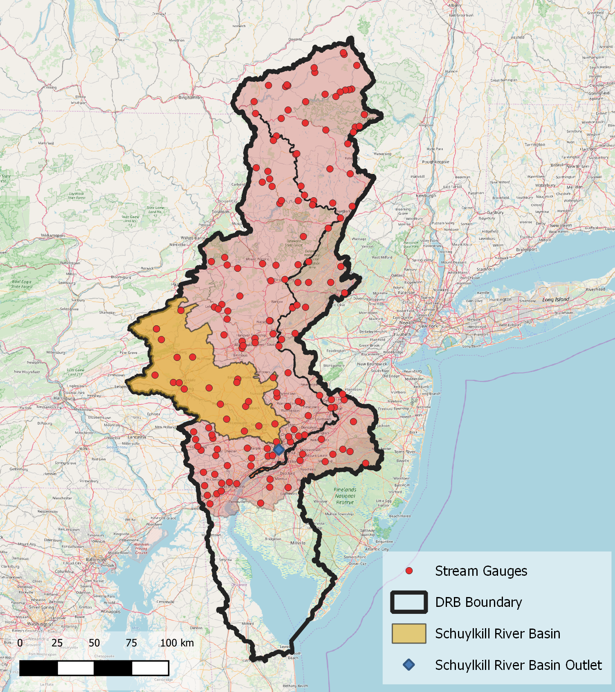

# Cloud-optimized USGS Time Series Data

## Introduction
The scalability, flexibility, and configurabilty of the commercial cloud provide new and exciting possibilities for many applications including earth science research. As with many organizations, the US Geological Survey (USGS) is exploring the use and advantages of the cloud for performing their science. The full benefit of the cloud, however, can only be realized if the data that will be used is ina cloud-friendly format.

In this blog post I'll compare three formats for storing time series data: Zarr, Parquet, and CSV. Zarr ([zarr.readthedocs.io](https://zarr.readthedocs.io/en/stable/)) and Parquet ([parquet.apache.org](https://parquet.apache.org)) are compressed, binary, data formats that can also be chunked or partitioned. This makes them a good choice for use on cloud-based environments where the number of computational cores can be scaled quickly and without limits common to more traditional HPC/HTC platforms. CSV will serve as a baseline comparison as a long-time standard format for time series data storage.

I am doing this comparision using time series data that are stored in and served from the USGS National Water Information System (NWIS). NWIS serves time series recorded at thousands observation locations throughout the US. These observations are of dozens of water science variables. My comparison will use discharge (or streamflow) data that were, for the most part, recorded 15 minute intervals.

## Comparison set up
There were two major comparisons. First I compared NWIS to Zarr for retrieval and formatting of time series for a subset of stations. Second I compared the write/read speeds and storage requirements between Zarr, Parquet, and CSV for the same subset of stations. I did these comparisons using a stock AWS EC2 t3a.large machine (8GB memory). The code I used to do these comparisons is [here](https://github.com/jsadler2/usgs_zarr_blog/blob/master/comparison.py). Both comparisons were done for 1) a 10-day period and 2) a 40-year period.  

Characteristics of pull

### Initial data gathering
For the first comparison, I first needed to gather the discharge data from all stations and write them to Zarr in an S3 bucket. Altogether this was data from more than 12,000 stations across the continental US for a period of record of 1970-2019 using the NWIS web services ([waterservices.usgs.gov/rest/IV-Service.html](https://waterservices.usgs.gov/rest/IV-Service.html)).

### Subset of basins
To do the comparison between the file formats I selected the Schuylkill river basin, a sub-basin of the Delaware River Basin. Recently, the USGS initiated a program for the Next Generation Water Observation System ([NGWOS](https://www.usgs.gov/mission-areas/water-resources/science/usgs-next-generation-water-observing-system-ngwos?qt-science_center_objects=0#qt-science_center_objects)) in the Delaware River Basin. NGWOS will provide denser, less expensive, and more rapid water quality and quantity data than what is currently being offered by the USGS and the DRB is the first basin to pilot the new systems. 

### Comparison 1: Data retrieval/formatting (Zarr vs. NWIS web services)
I recorded the time it took to retrieve and format data using the NWIS web services and then from Zarr. For the formatting of the data, I converted the data into a Pandas DataFrame with a DateTime index. I did this for one station (the overall outlet) and for all 23 stations in the sub-basin. I intended this comparison to answer the question: "If I have a bunch of sites in a data base (NWIS) or if I have a bunch of sites in a Zarr store, which one performs better at retrieving a relevant subset?" 

### Comparison 2: Data write, read, and storage (Zarr vs. Parquet vs CSV)
Once I retrieved the data subset, I wrote this subset to a new Zarr store, a Parquet file, and a CSV file. All of these files were written on the S3 bucket. I recorded the time it took to write to each of these formats, to read from each, and the storage sizes of each. 

## Results

### Comparison 1: Data retrieval and formatting

#### 10 days of data
| | Zarr | NWIS|
|---|---|---|
|Schuylkill outlet (sec)| 6.2 | 1.04| 
|all stations in Schuylkill basin (sec)| 7.2 | 19.7|  

#### 40 years of data 
| | Zarr | NWIS|
|---|---|---|
|Schuylkill outlet (sec)| 10.5 | 29.8 | 
|all stations in Schuylkill basin (sec)| 21 | 830 |  
|all stations in Schuylkill basin retrieve (sec)| | 401 |  

Zarr was much faster at retrieving and formatting data from a subset of observations compared to the NWIS web services. The performance difference increased as the volume of data requested increased. NWIS was actually faster for a single station for the 10-day request. When we increased the 10-day request to all 23 stations or the single station to a 40-year request, Zarr was close to 3x faster. The largest difference, though occurred when pulling the 40 years of data for all 23 stations: retrieving and formatting the data from Zarr was more than 40x faster compared to NWIS web services!

The 830 seconds it took to retrieve and format the 40 years of data from the 23 stations in the Schuylkill basin was split nearly evenly between retrieval and formatting. The formatting portion of process was necessary because NWIS webservices currently returns a plain text response which then has to be parsed and read into memory before analysis. When the Zarr data is retrieved, it is already in an analysis ready format as an Xarray dataset which can efficiently be operated on or converted to other formats such as a Pandas dataframe.

### Comparison 2: Data write, read, and storage

#### 10 days of data
| | Zarr | Parquet| CSV|
|---|---|---| ---|
|write (sec)| 1.23 | 0.15 | 0.15 | 
|read (sec)| 0.64 | 0.16 | 0.17 | 
|storage (kB)| 51.3 | 40.8 | 124.1 | 

#### 40 years of data 
| | Zarr | Parquet| CSV|
|---|---|---| ---|
|write (sec)| 5.5 | 1.7 | 28.4 | 
|read (sec)| 11.2 | 0.7 | 3.4 | 
|storage (MB)| 33.5 | 15.4 | 110 | 

For both the 10-day and 40-year dataset, the Parquet format was  

## Discussion and Conclusion

This example shows great promise in making large-scale USGS data more easily accessible through cloud-friendly formats on cloud storage. My speculation is that cloud-accessible data one day may serve as a complement to or a complete replacement of traditional web services. Because the S3 bucket is in the CHS cloud, any USGS researcher that has CHS access will have access to the same dataset that I did the tests on. Although I did the analysis on stations in the Schuylkill River Basin, similar results should be able to be produced with any arbitrary subset of NWIS stations. This retrieval is possible without any type of web-service for subsetting the data. Since Zarr is chunked, object storage it is easily and efficiently subsettable with functionality built into the interfacing software package (i.e., Xarray in Python). Additionally, the data is read directly into a computation friendly in-memory format (i.e., an Xarray dataset) instead of plain text in an HTML response as is delivered by a web service.

Beside efficient access, a major benefit of storing the data in the CHS S3 bucket in Zarr is the proximity to and propensity for scalable computing. Through the cloud, a computational cluster could be quickly scaled up to efficiently operate on the chunks of Zarr data. As USGS scientists become more accustomed to using cloud resources on CHS, having USGS data accessible in cloud-friendly formats will be a great benefit for large-scale research. The [Pangeo software stack](https://www.pangeo.io), which should be available through CHS soon, provides intuitive and approachable tools to help scientists perform cloud-based, scalable analyses on large cloud-friendly datasets.  
